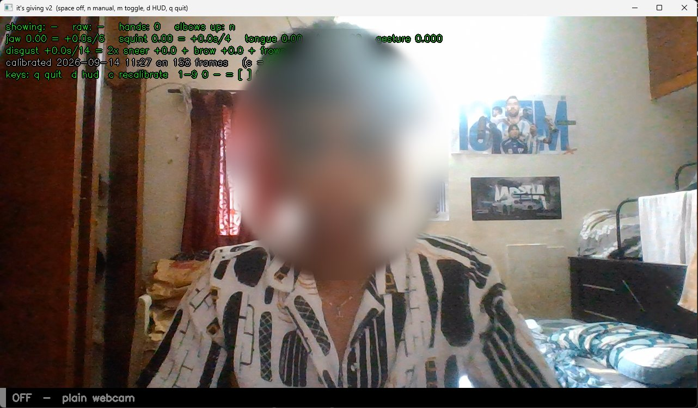

# The complete Google Meet guide

Everything you need to use the meme cam in Google Meet, from a fresh laptop to
your first FAHHHHH. It was written from a real setup and real test calls on a
Windows 11 laptop (Meet running in Brave). Every problem in the
troubleshooting table below actually happened.

**Contents:** [1 What you need](#1-what-you-need) ·
[2 One-time install](#2-one-time-install) ·
[3 Before every Meet](#3-before-every-meet) ·
[4 During the call](#4-during-the-call) ·
[5 Gestures that fire](#5-gestures-that-fire) ·
[6 After the call](#6-after-the-call) ·
[7 Habits that keep it a good idea](#7-habits-that-keep-it-a-good-idea) ·
[8 Troubleshooting](#8-troubleshooting) ·
[9 macOS and Linux](#9-macos-and-linux) ·
[10 Tuning with --trace](#10-tuning-with---trace)

---

## 1. What you need

- A laptop with a webcam (the one this was tested on: HP Wide Vision HD, 30 fps)
- **Python 3.9–3.12**. 3.12 is recommended; mediapipe has no wheel for 3.13+.
- **OBS Studio**. You never have to open it during a call; it just provides the
  **OBS Virtual Camera** device that Meet picks up.
- Google Meet in Chrome, Brave or Edge

How it fits together:

```
your webcam ──► meme cam (its_giving_v2.py) ──► OBS Virtual Camera ──► Google Meet
                 off: passes the frame through untouched
                 manual / auto: draws the meme on your head
```

Meet never touches your real webcam, only the virtual camera, and only the
meme cam decides what goes onto it.

---

## 2. One-time install

### 2.1 Python and OBS

On Windows, both install from a terminal:

```powershell
winget install --id Python.Python.3.12 --exact --scope user
winget install --id OBSProject.OBSStudio --exact
```

(OBS asks for administrator approval; click **Yes**.) Or download them from
[python.org](https://www.python.org/downloads/) and [obsproject.com](https://obsproject.com).

### 2.2 The meme cam

```powershell
git clone https://github.com/abishekashwinakash3-dotcom/itsgiving_-Updated_off-ON
cd itsgiving_-Updated_off-ON
powershell -ExecutionPolicy Bypass -File setup.ps1
```

`setup.ps1` does the rest: it finds Python, creates `venv\`, installs the
pinned dependencies, and runs `doctor.py`. A healthy result ends like this:

```
Webcam
  ok    camera 0: 640x480   <- default

Virtual camera (what Meet will see)
  ok    backend ready, device name: 'OBS Virtual Camera'
```

### 2.3 Calibrate (seven seconds)

Gesture mode measures your expressions against *your* resting face. The
`calibration.json` that ships with the repo belongs to someone else, and
`doctor.py` warns you about it.

```powershell
venv\Scripts\python its_giving_v2.py --calibrate
```

Sit how you normally sit, look at the camera, and hold a bored face. **Face
the light.** A bright window behind you washes your face out and leaves the
detector guessing. A good calibration prints no warnings:

```
Calibrated on 147 frames. Your neutral face:
  jawOpen          0.003 ± 0.015
  ...
```

You can recalibrate any time: press `c` in the preview window.

### 2.4 Put the launcher on your desktop

Right-click **`start.bat`** → **Send to** → **Desktop (create shortcut)**, and
rename the shortcut "Meme Cam". That is the only thing you'll open before a
call from now on.

---

## 3. Before every Meet

1. **Double-click "Meme Cam".** A small window opens and prints your hotkeys,
   then the preview window appears. It starts **OFF**: the bottom bar reads
   `OFF - plain webcam`.

   

2. **Join the Meet.** Start the meme cam *before* you join, so the browser
   finds the virtual camera straight away.
3. **Pick the camera:** click the **^** next to the camera button at the bottom
   → **OBS Virtual Camera**. (Or ⋮ → Settings → Video → Camera.) The browser
   remembers this, so usually you only do it once.

   

4. **Turn Meet's own effects off** (the Backgrounds and effects button → no
   effect). Background blur runs *after* your feed arrives and blurs memes into mush.
5. **Minimize** both meme cam windows. **Don't close them.**

Your self-view in Meet is exactly what everyone else sees, so it doubles as
your preview.

---

## 4. During the call

Keep your cursor in the Meet tab; the hotkeys work anyway.

| hotkey | does |
|---|---|
| **Ctrl+Alt+F** | **FAHHHHH** |
| **Ctrl+Alt+A** | gesture mode for 60 seconds, then back to off **by itself** |
| **Ctrl+Alt+N** | manual: armed, memes only when you fire one |
| **Ctrl+Alt+1–9, 0, -, =, [, ]** | fire memes 1–14 (table below) |
| **Ctrl+Alt+.** | off: plain webcam, right now |
| Ctrl+Alt+M | toggle off / last armed mode |

A fired meme stays up for about 2.5 seconds. You can fire memes while armed
(manual or gesture mode). While off, a fire is refused on purpose.

**The three modes:**

| mode | what the call sees | use it for |
|---|---|---|
| **off** (start) | your plain webcam; detection isn't even running | the whole call, until you want a meme |
| **manual** | your face, plus a meme only when you fire one | calls where funny is a bonus, not the point |
| **gesture mode** (auto) | memes fire from your gestures | a minute of chaos with friends, via Ctrl+Alt+A |

### The 15 memes

| # | meme | hotkey | preview key |
|---|---|---|---|
| 1 | time_out | Ctrl+Alt+1 | `1` |
| 2 | heart | Ctrl+Alt+2 | `2` |
| 3 | cover_nose | Ctrl+Alt+3 | `3` |
| 4 | crashing_out | Ctrl+Alt+4 | `4` |
| 5 | dance | Ctrl+Alt+5 | `5` |
| 6 | nose_closed | Ctrl+Alt+6 | `6` |
| 7 | flirty | Ctrl+Alt+7 | `7` |
| 8 | hand_up | Ctrl+Alt+8 | `8` |
| 9 | tongue_out | Ctrl+Alt+9 | `9` |
| 10 | open_mouth | Ctrl+Alt+0 | `0` |
| 11 | disgusted | Ctrl+Alt+- | `-` |
| 12 | talking_to_wall | Ctrl+Alt+= | `=` |
| 13 | suspicious | Ctrl+Alt+[ | `[` |
| 14 | spin | Ctrl+Alt+] | `]` |
| 15 | **fahhh** | **Ctrl+Alt+F** | `f` |


Typed commands work too, in the small window: `manual`, `heart`, `fahhh`,
`auto 60`, `hold heart` / `clear`, `status`, `list`. A **blank Enter** is the
panic button: straight back to off.

---

## 5. Gestures that fire

In gesture mode, a pose has to **hold for a moment**: each one must be seen on
several detections in a row before it fires. These tips come from traced test
rounds:

| meme | do this | tip from testing |
|---|---|---|
| time_out | referee's T: one hand flat on top, one vertical underneath | both hands clearly in frame |
| heart | heart hands, index tips and thumb tips touching | both hands visible, fingertips together |
| cover_nose | both palms over your mouth | **use Ctrl+Alt+3.** The hand model can't see palms pressed to the face (2 hands found in 0 of 247 detections) |
| crashing_out | both hands on your head, mouth open | scream it |
| dance | elbows up, hands behind your head, mouth closed | elbows must be in frame |
| nose_closed | pinch your nose | **hold still for ~3 s.** Fingers either side of the nose is fine |
| flirty | one fingertip on your lips | keep your palm away from your mouth |
| hand_up | open palm raised beside your head | fingers spread |
| tongue_out | tongue out, mouth open | **face the light.** Pink palms near the mouth can also read as a tongue |
| open_mouth | drop your jaw | easy; yawns count too |
| disgusted | scrunch your nose, or brows down and frown | exaggerate it |
| talking_to_wall | wave your hands in front of you | hands **away from your face**; hands held at the face no longer trigger it |
| suspicious | turn your head clearly and squint | **a big turn, held ~1.5 s.** Glances don't count, on purpose |
| spin | leave the frame completely | stay out for ~1.5 s |

---

## 6. After the call

Click the preview window and press **q twice** (within 2 seconds). A single
`q` only warns you, because quitting removes the camera. The small window then
says `Meme cam stopped`. Press any key to close it. Nothing keeps running in
the background.

---

## 7. Habits that keep it a good idea

- **Leave it in off.** Start every call off; arm only when you mean to.
- **Use Ctrl+Alt+A, not plain auto.** It switches itself off after 60 seconds,
  so it can't still be armed when a teacher or supervisor joins.
- **Never quit mid-call.** Meet pauses your video when the camera vanishes.
  Press Ctrl+Alt+. instead.
- **Check the room.** School and university Meets get recorded, and a
  recording outlives the joke. For anything near an admissions officer or a
  recommender, leave it off.
- **One face at a time.** Memes follow a single face; if someone walks behind
  you, the meme can jump onto them.

---

## 8. Troubleshooting

| what you see | why | fix |
|---|---|---|
| Meet: **"Another app is using the camera"** | Meet is set to your real webcam, which the meme cam is holding | **^** next to the camera button → **OBS Virtual Camera** |
| Meet video **paused / black** | the meme cam stopped (window closed, `q q`) | double-click **Meme Cam** again, then turn Meet's camera off and on |
| meme cam window **flashes and closes** at start | another app (often the browser) grabbed the real webcam first | set Meet to OBS Virtual Camera, close other camera apps, start again |
| **OBS Virtual Camera** not in Meet's list | the browser was open before OBS was installed | reload the Meet tab (F5) and rejoin |
| hotkeys do nothing | started without hotkeys | use **start.bat** (it passes `--hotkeys`) |
| video choppy while armed | an old version: detection blocked every frame (~9 fps) | update. Detection is threaded now (~27 fps measured) |
| gestures rarely fire | stranger's calibration, or backlit face | `--calibrate` facing the light; check `python doctor.py` |
| `suspicious` pops up on its own | old thresholds fired on glances | update: it now needs a clear, held turn |
| nose pinch shows `talking_to_wall` | old thresholds; a hand at the face read as waving | update: measured limits, and waving now ignores hands at the face |
| `cover_nose` never fires | hand model can't see palms pressed to the face | Ctrl+Alt+3 |
| meme lands on someone else | another face in frame | memes track one face; keep the frame to yourself |
| everything fires at once | calibrated mid-expression | recalibrate with a bored face |
| MediaPipe aborts on start (macOS) | a dependency got unpinned | `pip install -r requirements.txt` |

When in doubt, run `venv\Scripts\python doctor.py`. It names what is wrong and
the command that fixes it.

---

## 9. macOS and Linux

```bash
./setup.sh
source venv/bin/activate
python its_giving_v2.py --calibrate
python its_giving_v2.py --hotkeys
```

- **macOS:** install OBS Studio, open it once, quit it. Allow your terminal
  under System Settings → Privacy & Security → **Camera** and
  **Accessibility** (for the hotkeys).
- **Linux:** `sudo apt install v4l2loopback-dkms && sudo modprobe v4l2loopback`.

The Meet steps are identical; the camera is named by the script when it starts.

---

## 10. Tuning with --trace

If a gesture won't fire or fires too easily, measure before you change anything:

```powershell
venv\Scripts\python its_giving_v2.py --hotkeys --trace trace.csv
```

Press Ctrl+Alt+A and do the gesture a few times. `trace.csv` records every
armed detection: the decision, head turn, squint, thumb/index-to-nose and
palm-to-mouth distances (in face-widths), hand motion, and wrist positions.
That's how the nose pinch was fixed: the trace showed a real pinch measures
thumb 0.41–0.43 and gap 0.45–0.48 face-widths, against old limits of 0.35 and
0.30. The thresholds live in `decide()` and in `Z`, `FLOOR` and `ARM` at the
top of `its_giving_v2.py`.
