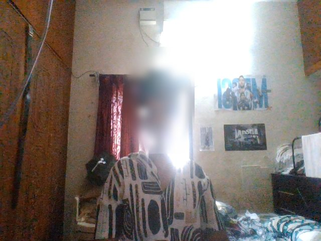
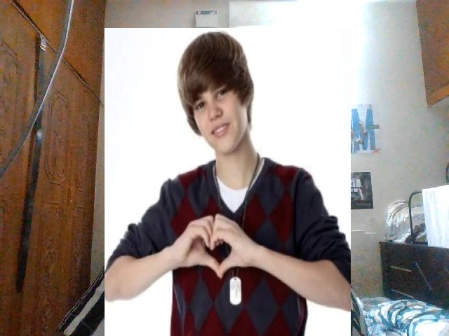
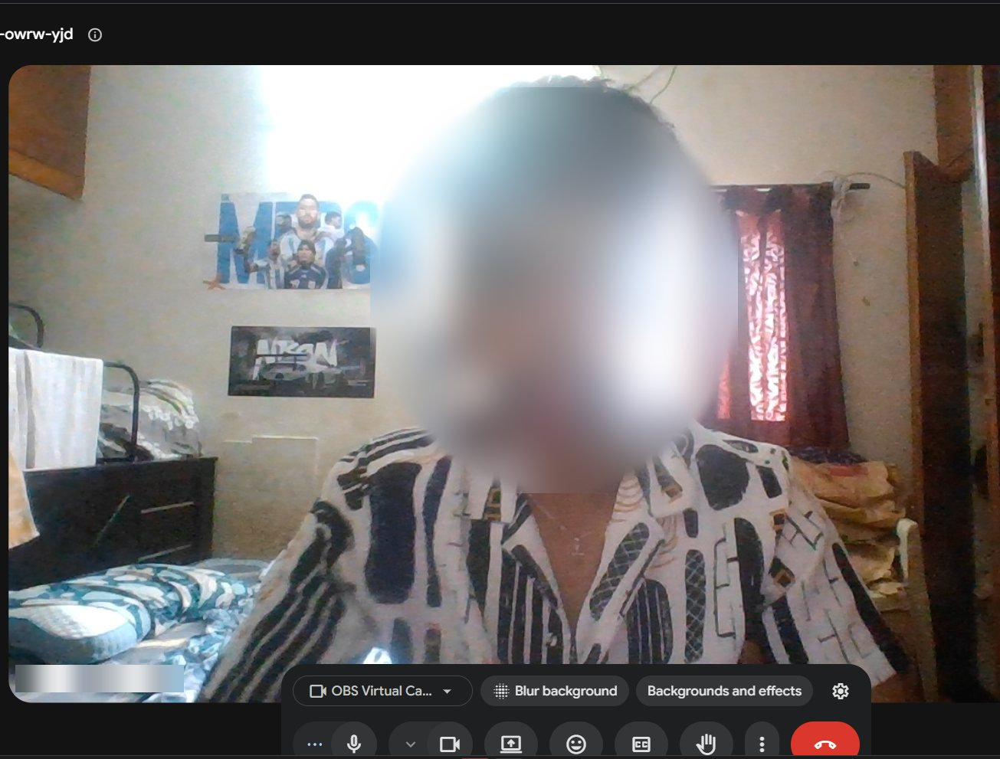
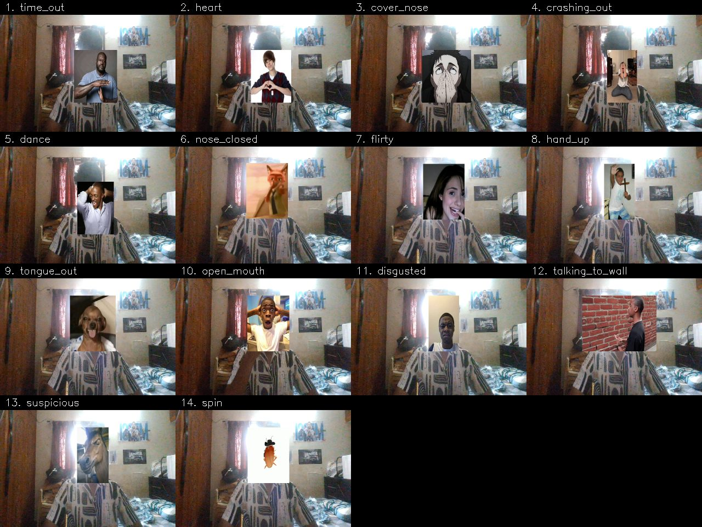
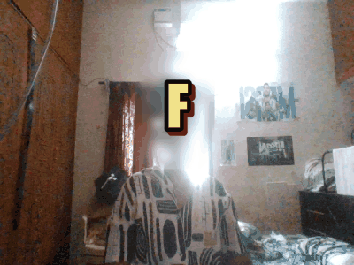
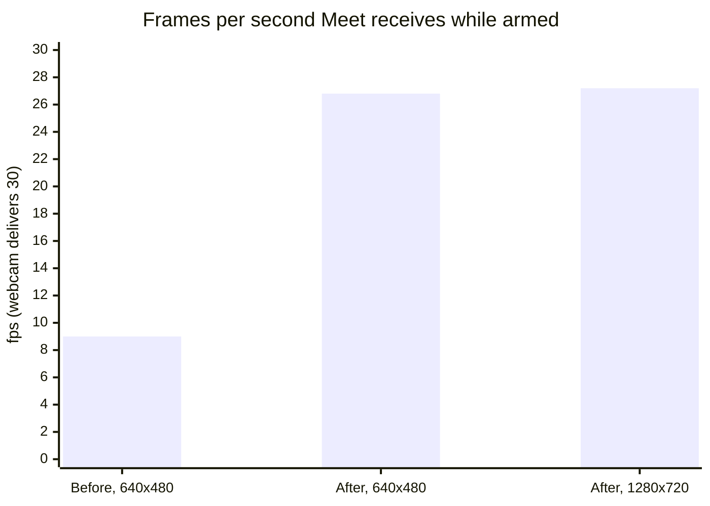

# The MEME CAM for Google Meet, VideoCalls & CAMs  


Pull a face at your webcam and the matching meme lands on your head, live, in
Google Meet. Or keep it switched off, fire any meme with a hotkey, and your
friends never see it coming.

**Website:** <https://abishekashwinakash3-dotcom.github.io/itsgiving_-Updated_off-ON/> ·
**Complete Google Meet guide:** [MEET_SETUP.md](MEET_SETUP.md)

<table>
  <tr>
    <td width="50%"></td>
    <td width="50%"></td>
  </tr>
  <tr>
    <td align="center"><b>off</b> — your plain webcam</td>
    <td align="center"><b>Ctrl+Alt+2</b> — what the call sees a second later</td>
  </tr>
</table>

<sub>Both frames were captured straight off OBS Virtual Camera, the exact feed
Google Meet receives, during a real test on 14 September 2026. Faces are
blurred for privacy.</sub>

Built on [gazijarin/itsgiving](https://github.com/gazijarin/itsgiving) by Gazi
(MIT). This fork adds a safe **off / manual / auto** layer, hotkeys that work
while Meet has focus, a one-click Windows launcher, a 15th meme (**FAHHHHH**),
3× smoother video while armed, and detection tuned from real measurements.

---

## Quick start: Google Meet on Windows

**Once:**

```powershell
git clone https://github.com/abishekashwinakash3-dotcom/itsgiving_-Updated_off-ON
cd itsgiving_-Updated_off-ON
powershell -ExecutionPolicy Bypass -File setup.ps1
```

`setup.ps1` finds Python 3.12, builds the virtualenv, installs the pinned
dependencies, runs `doctor.py`, and offers the seven-second calibration.
Install [OBS Studio](https://obsproject.com) too — it provides the
**OBS Virtual Camera** that Meet will use. Then right-click `start.bat` →
**Send to → Desktop (create shortcut)**.

**Before every Meet:**

1. Double-click the **start.bat** shortcut. It starts **OFF** — a plain webcam.
2. In Meet, click the **^** next to the camera button → **OBS Virtual Camera**.
3. Minimize both windows. Don't close them.

**During the call** (keep your cursor in Meet):

| hotkey | does |
|---|---|
| **Ctrl+Alt+F** | FAHHHHH |
| **Ctrl+Alt+A** | gesture mode for 60 seconds, then off by itself |
| **Ctrl+Alt+N** | manual — memes only when you fire one |
| **Ctrl+Alt+1–9, 0, -, =, [, ]** | fire memes 1–14 |
| **Ctrl+Alt+.** | off — plain webcam |

**After the call:** click the preview window and press **q twice**.

macOS and Linux: run `./setup.sh`, then `python its_giving_v2.py --hotkeys`.
Everything else is the same. Full walkthrough and troubleshooting:
[MEET_SETUP.md](MEET_SETUP.md).

---

## It really works in Google Meet



<sub>Google Meet with **OBS Virtual Camera** selected, fed by the meme cam
(in off, so a plain webcam). Face and name blurred.</sub>

All 14 original memes, fired one after another during a live Meet and captured
off the virtual camera:



And the new one:

<p align="center"></p>

<sub>The FAHHHHH animation composited onto a captured frame. The caption is an
original graphic in <code>assets/fahhh.gif</code>. It is picture only — a
virtual camera carries no sound to Meet.</sub>

---

## The 15 memes

| # | meme | gesture (in gesture mode) | hotkey |
|---|---|---|---|
| 1 | `time_out` | referee's T — one hand flat on top, one vertical underneath | Ctrl+Alt+1 |
| 2 | `heart` | heart hands — index tips and thumb tips touching | Ctrl+Alt+2 |
| 3 | `cover_nose` | both palms over your mouth — *use the hotkey, see below* | Ctrl+Alt+3 |
| 4 | `crashing_out` | both hands on your head, mouth open | Ctrl+Alt+4 |
| 5 | `dance` | elbows up, hands behind your head, mouth closed | Ctrl+Alt+5 |
| 6 | `nose_closed` | pinch your nose and hold still | Ctrl+Alt+6 |
| 7 | `flirty` | one fingertip on your lips | Ctrl+Alt+7 |
| 8 | `hand_up` | open palm raised beside your head | Ctrl+Alt+8 |
| 9 | `tongue_out` | tongue out, mouth open, facing the light | Ctrl+Alt+9 |
| 10 | `open_mouth` | jaw drops | Ctrl+Alt+0 |
| 11 | `disgusted` | scrunch your nose, or brows down and frown | Ctrl+Alt+- |
| 12 | `talking_to_wall` | hands waving in front of you, away from your face | Ctrl+Alt+= |
| 13 | `suspicious` | a big head turn plus a squint, held about 1.5 s | Ctrl+Alt+[ |
| 14 | `spin` | leave the frame completely | Ctrl+Alt+] |
| 15 | `fahhh` | none — fire it on purpose | **Ctrl+Alt+F** |

Swap any meme by dropping a JPEG, PNG or animated GIF named after the pose
into `assets/` — `heart.png` replaces the heart.

---

## Tested on a real laptop

Everything below was measured on 14 September 2026: Windows 11, HP Wide Vision
HD webcam (30 fps), Python 3.12.10, mediapipe 0.10.21, NumPy 1.26.4,
OpenCV 4.11.0, pyvirtualcam 0.15.0, OBS Studio 32.2.1, Google Meet in Brave.

### Smooth video while armed

Arming used to drop Meet to about 9 fps: the virtual camera only got a frame
after all three MediaPipe models finished (face 5.1 ms, hands 35.3 ms,
body 43.2 ms per frame at 640×480). Detection now runs on a background thread,
and every webcam frame goes straight through.



Detection runs on a 640-pixel-wide copy of each frame. On three real faces, its
landmarks landed within **0.8 px** of full-resolution detection.

### Checks that pass

| what | result |
|---|---|
| `setup.ps1`, end to end on a clean Windows install | exit 0, every `doctor.py` check ok |
| live test read back off OBS Virtual Camera (starts off, refuses memes while off, manual, meme visible, panic, timed auto, quit) | **15 / 15** |
| hotkeys driven by real keyboard-hook events | **23 / 23** |

### Gestures tuned from traced data

`--trace` writes what the detector measured on every frame. One 90-second
trace (703 detections) showed why the nose pinch never fired. A real pinch
measures index 0.22, thumb 0.41–0.43 and a 0.45–0.48 thumb–index gap, in
face-widths: the fingers sit either side of the nose. The old limits
(0.35 / 0.35 / 0.30) could never match that. Meanwhile a hand held at the face
jitters enough to count as "waving", so `talking_to_wall` stole the pose.

| phase of the trace | pinch matches, old → new | stolen by talking_to_wall, old → new |
|---|---|---|
| hand at nose, moving | 5 → **71** | 68 → **5** |
| still pinch | 1 → **67** | 24 → **7** |
| palms over mouth (should not match) | 1 → 1 | 29 → **4** |

In the next live round, `nose_closed` fired twice and `talking_to_wall` fired
zero times. `suspicious` had misfired 4 and then 3 times per minute on glances
at another window. It now needs a clear head turn (0.22) held for about
1.2 seconds, and it misfired 0 times in the next round.

**Known gap:** with both palms over the mouth, the hand model found two hands
in 0 of 247 detections, so `cover_nose` rarely fires from the gesture. Use
Ctrl+Alt+3.

---

## Modes

It starts in `off`.

| mode | detectors | what the call sees |
|---|---|---|
| `off` *(default)* | not running at all | your plain webcam |
| `manual` | running | your face, plus a meme **only** when you fire one |
| `auto` | running | memes fire from your gestures |

In `off` the frame is a straight pass-through. The MediaPipe calls are skipped
entirely, so there is no code path that can draw anything.

Type commands into the terminal running the script, or use the hotkeys:

| command | effect |
|---|---|
| *(blank Enter)* | **panic — straight to off** |
| `off` / `panic` | plain webcam |
| `manual` | armed, memes on command only |
| `auto` | memes fire from gestures |
| `auto 60` | auto for 60 seconds, then back to off **by itself** (= Ctrl+Alt+A) |
| `heart`, `crash`, `2`, `fahhh` | fire that meme (name, prefix or number) |
| `hold heart` / `clear` | keep one up until cleared |
| `list` / `status` / `help` / `quit` | … |

Keys in the preview window: `space` off · `n` manual · `m` toggle · `d` HUD ·
`c` recalibrate · `1`–`9` `0` `-` `=` `[` `]` fire a meme · `f` FAHHHHH ·
**`q` twice within 2 s** to quit.

**Build the timed habit.** The realistic mistake isn't forgetting to switch it
on; it's forgetting it's still on two hours later. `auto 60` (Ctrl+Alt+A)
switches itself off, so it can't still be armed when someone who matters dials
in. And check the room first: calls get recorded, and a recording outlives the
joke.

**Don't quit it mid-call.** Quitting removes the camera device and Meet pauses
your video. Leave it running in `off` instead. That's why a single `q` only
warns: quitting takes two presses.

---

## Setup details

Python 3.9–3.12 (mediapipe 0.10.21 has no wheel for 3.13+). Three MediaPipe
models (~17 MB) download themselves on first run. By hand:

```bash
python3.12 -m venv venv
source venv/bin/activate           # Windows: venv\Scripts\activate
pip install -r requirements.txt
python doctor.py
python its_giving_v2.py --calibrate
```

**`python doctor.py` is the thing to run when something is wrong.** It checks
the Python version, the dependency pins, the models and all 15 meme images,
whose face the calibration belongs to, which camera indexes work, and whether a
virtual-camera backend exists. For each problem it prints the command that
fixes it.

**Calibrate before you rely on gesture mode.** The `calibration.json` that
ships in this repo is somebody else's resting face. It loads without any
warning and quietly measures your expressions against a stranger's neutral.
`doctor.py` flags it, including on Windows, where git's line-ending conversion
used to hide it. Keep your own calibration out of your commits.

**Don't unpin the dependencies.** MediaPipe 0.10.30+ ships macOS wheels that
abort the moment they open a detector, so it's held at 0.10.21. That build
needs NumPy 1.x, and OpenCV 5 needs NumPy 2. On top of that, 0.10.21 asks for
an *unpinned* `opencv-contrib-python`, which quietly drags OpenCV 5, and
therefore NumPy 2, back in. Unpin one and you have to unpin all three.

---

## How it works

```
camera frame ──────────────────────────────────────────────► virtual camera (every frame)
     │                                                              ▲
     └─► background thread: MediaPipe on a 640-wide copy            │
           face: 478 landmarks + 52 blendshapes                     │
           hands: 2 × 21 points · body: shoulders, elbows, wrists   │
              │                                                     │
              ▼                                                     │
         measures → sigma above YOUR neutral → decide()             │
         (first matching pose wins) → must persist N detections ────┘ overlay
```

### Normalising away the camera

Nothing is compared in pixels. Every distance is divided by the width of your
face box first, so `near(hand.index, face.nose, 0.35)` means "within 35% of a
face width" at 40 cm and at a metre and a half.

### Why fixed thresholds don't work

MediaPipe's blendshapes are **not zero at rest**, and the offset is personal:
some faces idle at `jawOpen` 0.02, others at 0.19. So `jawOpen > 0.5` is a
different threshold for every face. v2 records seven seconds of your neutral
face — the mean and wobble of all 52 channels — and scores every expression as

```
z = (what the channel reads now − your resting mean) / your resting wobble
```

"6 sigma above your neutral jaw" means the same thing on every face.

### Tuning from data

```bash
python its_giving_v2.py --hotkeys --trace trace.csv
```

The trace logs, for every armed detection: the decision, head turn, squint,
fingertip-to-nose and palm-to-mouth distances, hand motion, and pose-model
wrist positions. Tune `decide()` against those numbers, not by feel.

### Adding a pose

1. Drop `assets/thinking.png` in place.
2. Add `"thinking"` to `POSES` (the list is checked top to bottom; first match wins).
3. Add a branch to `decide()`:

```python
    for h in hands:
        if near(h.palm, face.chin, 0.5) and not h.open:
            return "thinking", d
```

4. Give it an `ARM` count if it's twitchy, then check it with `--trace`.

---

## What's where

```
start.bat          Windows: double-click before a Meet (starts off, hotkeys on)
its_giving_v2.py   the calibrated meme cam — the one to use
meme_control.py    the off / manual / auto layer, commands and hotkeys
doctor.py          checks this machine can run it, and says what to fix
setup.ps1          one-command install (Windows)
setup.sh           one-command install (macOS / Linux)
MEET_SETUP.md      the complete Google Meet guide and troubleshooting
its_giving.py      v1: same poses, fixed thresholds
assets/            the memes, named after their pose
docs/              the project website (GitHub Pages)
requirements.txt   pinned on purpose — read the comments before changing them
```

## Credits

Original project, poses and meme set: [gazijarin/itsgiving](https://github.com/gazijarin/itsgiving)
by Gazi, MIT licensed — see [LICENSE](LICENSE). This fork: the arm/disarm
layer, Meet hotkeys, the Windows launcher and installer, `doctor.py`, threaded
detection, trace-based tuning, and the FAHHHHH meme. It was built and tested
with Claude Code.
